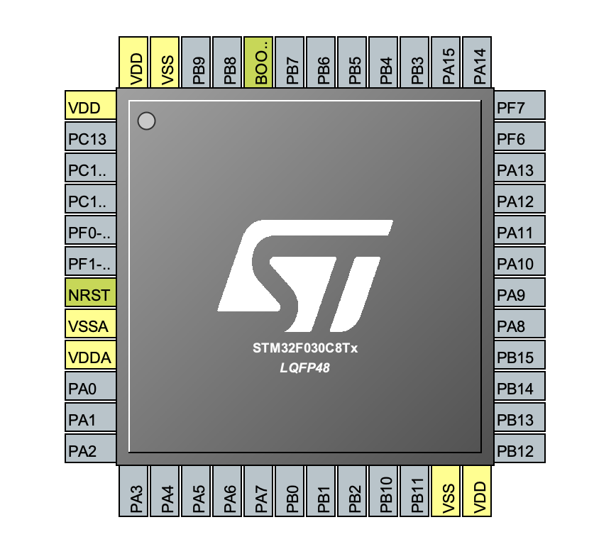
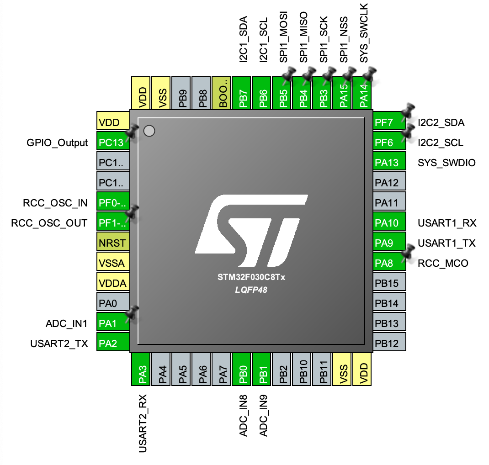

# Getting To Blinky on the Central Command

This is "Getting To Blinky" on an STM32 home-built dev board.

The Central Command is a dev board built as part of a class exercise for the Contextual Electronics
on-line electronics course.  Central Command is constructed around an STM32F030R8 32-bit ARM MCU
with an 8 MHz external crystal.
The dev board uses an FTDI device for USB communication and has breakouts for all source of wonderful
I/O.  Programming the Central Command dev board can be accomplished using the 
ST-LINK/V2-1 hardware debugger/programmer that comes with any of STMicroelectronics NUCLEO
development boards.  With only one judicious jumper selection, the ST-LINK/V2-1 can be used to program
home-brew boards built around the STmicro chips.

## Central Command
The schematics are found in [Central Command Schematic.pdf](../CentralCommand/Central%20Command%20Schematic.pdf) 
and the board layout is found in [Central Command Layout.pdf](../CentralCommand/Central%20Command%20Layout.pdf).  
Header P101 breaks out I2C2 peripheral for 
an I2C sensor connection.  Headers P302 and P303 provide chained I2C connections for external boards over
the I2C1 peripheral.  USART1 and SPI connections are available on headers P104 and P105, respectively.  The USART2 
peripheral is dedicated to USB communications via the FTDI FT232RQ device.  Finally, headers P102 and P103
provide access to a number of GPIO pins.

A user LED is available on pin PB10.  Power can be provided over the USB port or via header P202.  P202 can
accomodate an external power supply between +3.75V and +6V.  The power supply can provide up to
250 mA to the board.  A reset button is provided and header P304
provides access to the BOOT0 pin.  Header P301 accomodates an ST-LINK programming connection.

## Pin Configurations
The STM32F030R8 package has 48 pins, but this is not sufficient for each pin to have a unique functions and
still provide access to all of the STM32F030R8 functions.  To remedy this, each pin has a primary (default)
function and a set of possible alternate functions.  The collection of peripherals used by Central Command
requires the use of a number of alternate functions for several pins.  

The default pin layout is

The pin layout for Central Command can
be summarized (using ST32CUBEMX) as

The pins in green have been changed from their default layout.  A summary of the changes:

|Pin|Default Function |Alternate Function |
|----|---|---|
| 5   | PF0 | RCC_OSC_IN |
| 6   | PF1 | RCC_OSC_OUT |
| 11 | PA1 | ADC_IN1 |
| 12 | PA2 | USART2_TX (AF1) |
| 13 | PA3 | USART2_RX (AF1) |
| 18 | PB0 | ADC_IN8 |
| 19 | PB1 | ADC_IN9 |
| 21 | PB10 | User LED |
| 29 | PA8 | RCC_MCO (AF0) |
| 30 | PA9 | USART1_TX (AF1) |
| 31 | PA10 | USART1_RX (AF1) |
| 34 | PA13 | SYS_SWDIO (AF0) |
| 35 | PF6 | I2C2_SCL |
| 36 | PF7 | I2C2_SDA |
| 37 | PA14 | SYS_SWCLK (AF0) |
| 38 | PA15 | SPI1_NSS (AF0) |
| 39 | PB3 | SPI1_SCK (AF0) |
| 40 | PB4 | SPI1_MISO (AF0) |
| 41 | PB5 | SPI1_MOSI (AF0) |
| 42 | PB6 | I2C1_SCL (AF1) |
| 43 | PB7 | I2C1_SDA (AF1) |

Pin 21 still has its default assignment, but has been modified for GPIO output
(Push Pull output and no pull-up or pull-down resistors).  Note that Pin 2 (PC13)
has a very limited capability to supply power (3 mA).  Don't use it to drive an LED
unless a FET is used.

Pins 35 and 36 are unusual in this package and only have one Alternate Function to select.
Pins 5, 6, 11, 18,  and 19 are not being used for Alternate Functions, but rather Additional Functions
(not my nomenclature, believe me).

## Finally
Yes, the pin configuration discussion was painful, but it's over.  As to flashing an LED, we will use the on-board LED on
PB10 (pin 21).  The programming details are discussed in the READMEs located in the folders HAL, LL, and CMSIS - the 
three approaches used for programming.  However, the hardware used for programming is common to all three.

(Note:  cudos to JEELABS, https://jeelabs.org/book/1547a/ for helping me understand all of this.)

Programming is performed using the ST-LINK portion of a NUCLEO board (in this case, a NUCLEO-F030R8).  Once a set of jumpers
are moved to the appropriate position, the STLINK does not communicate with the NUCLEO board but with the CentralCommand
connected via a set of header pins.  

Here is a shot of the programming interface on an STM32NUCLEO board (in this case a NUCLEO-F103RB).

To use the ST-LINK programmer for the CentralCommand board, the first thing that must be done is to remove the two
jumpers shown in the center-left of the image.  To avoid losing the jumpers, they can be turned to the side so that each
jumper only connects to one pin (i.e. "no jumping").

Jumper wires (or a 6-wire cable) is used to connect the ST-LINK programmer to the CentralCommand.  The programming header
on the ST-LINK is labeled CN4 and is on the left side of the previous image.  The pins (from top to bottom) are
1.  VDD-TARGET
2.  SWCLK
3.  GND
4.  SWDIO
5.  NRST
6.  SWO

The cable connects to the P301 header on the CentralCommand (shown on both the schematics and the layout images).
The P301 header is located on the right of the bottom edge of the board.  The pins are labeled on the reverse side of the board.
Note that Pin 6 isn't connected anything. 

